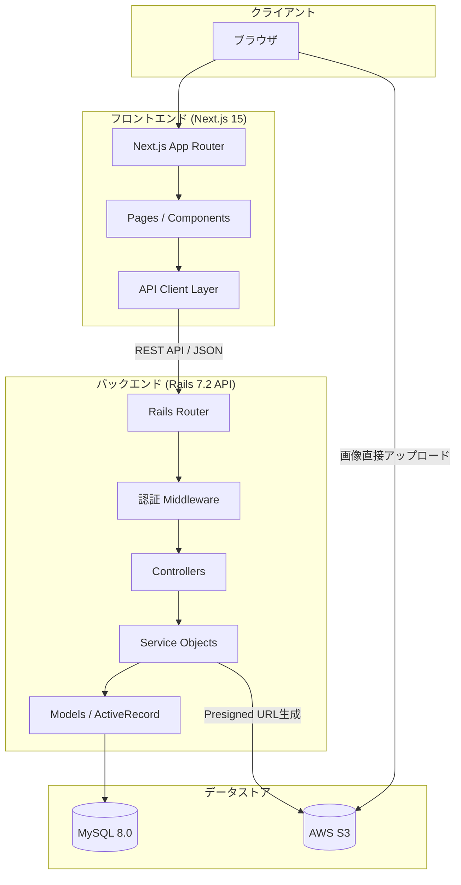
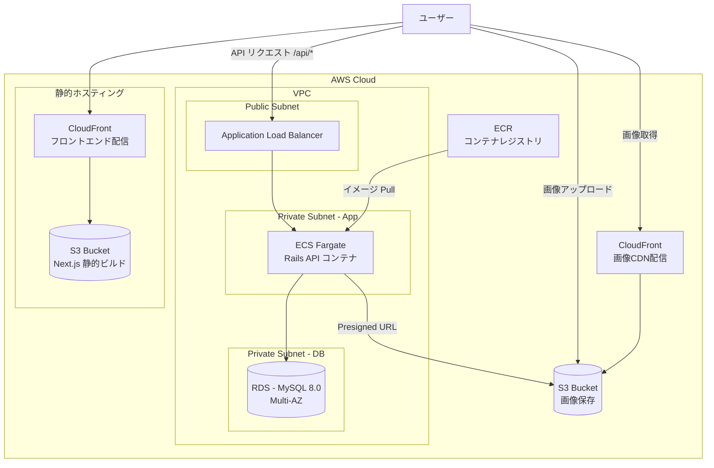
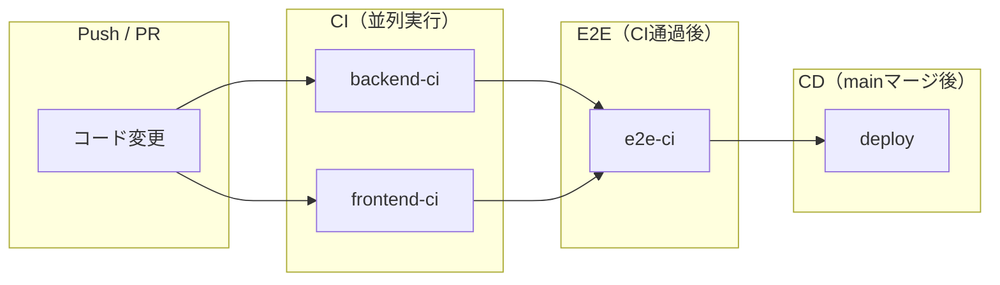
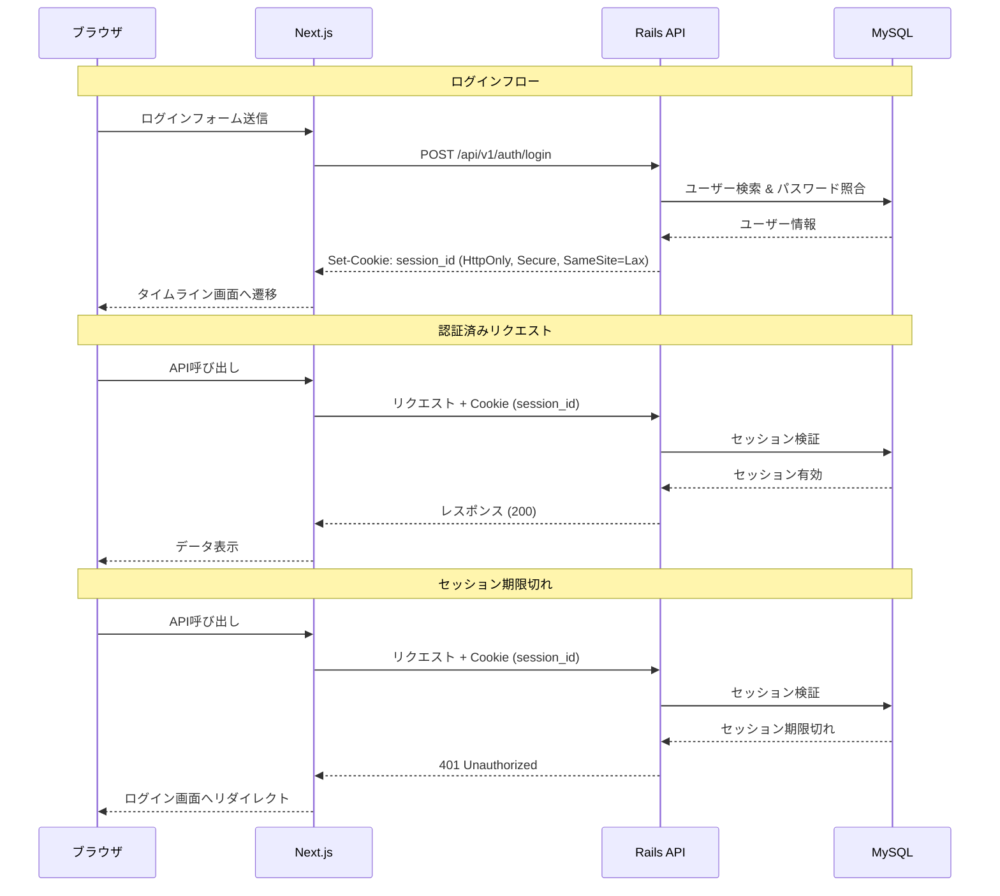
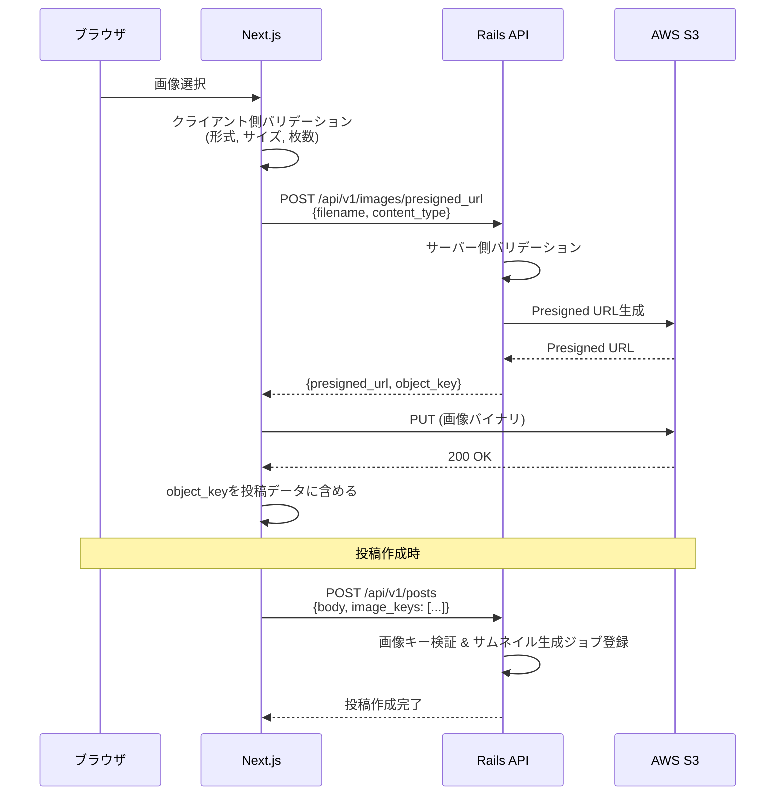
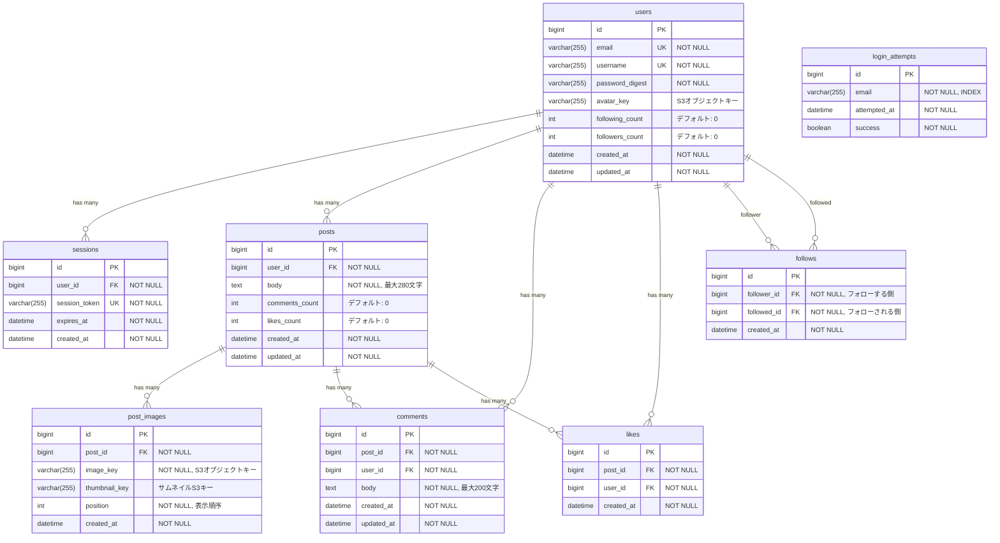

# Design Document: TripShare - 旅行記録SNSアプリ

## Overview

TripShareは、X/Twitterのタイムライン形式を参考にしたテキストベースの旅行記録SNSアプリケーションである。ユーザーは旅行の記録をテキスト・画像で投稿し、他ユーザーの投稿にいいねやコメントを付けることができる。

### 技術スタック

| レイヤー | 技術 |
|---------|------|
| フロントエンド | Next.js 15 / React 19 / TypeScript 5 / Tailwind CSS 3 |
| バックエンド | Ruby on Rails 7.2（APIモード）/ Ruby 3.3 |
| データベース | MySQL 8.0 |
| 画像保存 | AWS S3 |
| 開発環境 | Docker Compose |
| 本番インフラ | AWS（ECS Fargate + ALB + RDS + S3 + CloudFront） |
| IaC | Terraform |
| CI/CD | GitHub Actions |

### 設計方針

- フロントエンドとバックエンドを完全に分離したSPA + API構成
- RESTful APIによる通信（JSON形式）
- セッションベース認証（Cookieベース）
- 画像はPresigned URLを用いてクライアントからS3へ直接アップロード
- 無限スクロールによるページネーション（カーソルベース）

## Architecture

### システムアーキテクチャ概要



### インフラ構成図（AWS本番環境）



**インフラ構成のポイント:**

- **S3 + CloudFront（フロントエンド）**: Next.js を `output: 'export'` でSSG（静的サイト生成）し、S3にデプロイ。CloudFrontで配信する
- **ECS Fargate（バックエンド）**: Rails APIをDockerコンテナとしてFargateで実行。サーバー管理不要
- **ALB**: HTTPS終端、ヘルスチェック、ECSタスクへの振り分け
- **ECR**: DockerイメージのプライベートレジストリとしてECSからPull
- **RDS**: MySQL 8.0、Multi-AZ配置で可用性を確保、Private Subnet内に配置
- **S3（画像）**: 画像ファイルの永続保存、Presigned URLでクライアントから直接アップロード
- **CloudFront（画像）**: S3前段のCDNで画像配信を高速化

**Terraform によるIaC:**

インフラは全て Terraform で管理する。

```
terraform/
├── main.tf              # プロバイダー設定、バックエンド設定
├── variables.tf         # 変数定義
├── outputs.tf           # 出力値
├── vpc.tf               # VPC、サブネット、IGW、NAT GW、ルートテーブル
├── security_groups.tf   # セキュリティグループ（ALB、ECS、RDS）
├── alb.tf               # ALB、ターゲットグループ、リスナー
├── ecs.tf               # ECSクラスター、タスク定義、サービス
├── ecr.tf               # ECRリポジトリ
├── rds.tf               # RDSインスタンス、サブネットグループ、パラメータグループ
├── s3.tf                # S3バケット（フロントエンド用、画像用）
├── cloudfront.tf        # CloudFrontディストリビューション（フロントエンド用、画像用）
├── iam.tf               # IAMロール（ECSタスク実行ロール、タスクロール）
├── ssm.tf               # SSM Parameter Store（環境変数・シークレット管理）
└── terraform.tfvars     # 環境固有の変数値（.gitignore対象）
```

**Terraform設計方針:**
- tfstate は S3 + DynamoDB でリモート管理
- 環境変数・シークレットは SSM Parameter Store で管理
- ECSタスク定義で環境変数をSSMから参照
- セキュリティグループは最小権限で設定（ALB→ECS→RDS の通信のみ許可）

### Docker Compose構成（開発環境）

```yaml
# docker-compose.yml
version: '3.8'

services:
  frontend:
    build:
      context: ./frontend
      dockerfile: Dockerfile
    ports:
      - "3000:3000"
    volumes:
      - ./frontend:/app
      - /app/node_modules
    environment:
      - NEXT_PUBLIC_API_URL=http://localhost:3001
    depends_on:
      - backend

  backend:
    build:
      context: ./backend
      dockerfile: Dockerfile
    ports:
      - "3001:3000"
    volumes:
      - ./backend:/app
    environment:
      - DATABASE_URL=mysql2://root:password@db:3306/tripshare_development
      - RAILS_ENV=development
      - AWS_ACCESS_KEY_ID=${AWS_ACCESS_KEY_ID}
      - AWS_SECRET_ACCESS_KEY=${AWS_SECRET_ACCESS_KEY}
      - AWS_REGION=ap-northeast-1
      - S3_BUCKET_NAME=tripshare-images-dev
    depends_on:
      db:
        condition: service_healthy

  db:
    image: mysql:8.0
    ports:
      - "3306:3306"
    environment:
      - MYSQL_ROOT_PASSWORD=password
      - MYSQL_DATABASE=tripshare_development
    volumes:
      - mysql_data:/var/lib/mysql
    healthcheck:
      test: ["CMD", "mysqladmin", "ping", "-h", "localhost"]
      interval: 10s
      timeout: 5s
      retries: 5

volumes:
  mysql_data:
```

### CI/CD パイプライン（GitHub Actions）



**CI ワークフロー構成:**

| ワークフロー | トリガー | 実行内容 |
|-------------|---------|---------|
| backend-ci | Push/PR で `backend/**` 変更時 | RuboCop + Brakeman + RSpec（単体・統合・rswag） |
| frontend-ci | Push/PR で `frontend/**` 変更時 | ESLint + Prettier + tsc --noEmit + Vitest + next build |
| e2e-ci | backend-ci & frontend-ci 通過後 | Docker Compose起動 → Playwright E2E |
| deploy | main マージ時 | ECRプッシュ → ECSデプロイ / S3 + CloudFront デプロイ |

**静的解析ツール:**

| レイヤー | ツール | 目的 |
|---------|--------|------|
| バックエンド | RuboCop | コードスタイル + lint |
| バックエンド | Brakeman | セキュリティ脆弱性スキャン |
| フロントエンド | ESLint | TypeScript lint |
| フロントエンド | Prettier | コードフォーマット確認 |
| フロントエンド | `tsc --noEmit` | 型安全性チェック |

**CI設定ファイル:**
```
.github/workflows/
├── backend-ci.yml
├── frontend-ci.yml
├── e2e-ci.yml
└── deploy.yml
```

## Components and Interfaces

### フロントエンド コンポーネント構成

```
frontend/
├── src/
│   ├── app/                    # App Router
│   │   ├── (auth)/             # 認証グループ
│   │   │   ├── login/page.tsx
│   │   │   └── register/page.tsx
│   │   ├── (main)/             # メインレイアウトグループ
│   │   │   ├── timeline/page.tsx
│   │   │   ├── posts/[id]/page.tsx
│   │   │   ├── users/[id]/page.tsx
│   │   │   ├── users/[id]/followers/page.tsx
│   │   │   ├── users/[id]/following/page.tsx
│   │   │   └── search/page.tsx
│   │   ├── layout.tsx
│   │   └── page.tsx            # ルート（リダイレクト）
│   ├── components/
│   │   ├── auth/               # 認証関連コンポーネント
│   │   ├── posts/              # 投稿関連コンポーネント
│   │   ├── comments/           # コメント関連コンポーネント
│   │   ├── users/              # ユーザー関連コンポーネント
│   │   └── ui/                 # 共通UIコンポーネント
│   ├── hooks/                  # カスタムフック
│   ├── lib/                    # ユーティリティ・APIクライアント
│   └── types/                  # TypeScript型定義
```

### 画面一覧とルーティング

| パス | ページ | 認証 | 説明 |
|------|--------|------|------|
| `/` | ルート | 不要 | ログイン画面 or タイムラインへリダイレクト |
| `/login` | ログイン | 不要 | メールアドレス・パスワードでログイン |
| `/register` | ユーザー登録 | 不要 | 新規アカウント作成 |
| `/timeline` | タイムライン | 必要 | 全体 / フォロー中の投稿一覧 |
| `/posts/[id]` | 投稿詳細 | 必要 | 投稿本文・画像・コメント一覧 |
| `/users/[id]` | プロフィール | 必要 | ユーザー情報・投稿一覧 |
| `/users/[id]/followers` | フォロワー一覧 | 必要 | フォロワーリスト |
| `/users/[id]/following` | フォロー一覧 | 必要 | フォロー中ユーザーリスト |
| `/search` | ユーザー検索 | 必要 | ユーザー名で検索 |

### バックエンド API設計（RESTful）

#### 認証 API

| メソッド | エンドポイント | 説明 |
|----------|---------------|------|
| POST | `/api/v1/auth/register` | ユーザー登録 |
| POST | `/api/v1/auth/login` | ログイン |
| DELETE | `/api/v1/auth/logout` | ログアウト |
| GET | `/api/v1/auth/me` | 現在のユーザー情報取得 |

#### 投稿 API

| メソッド | エンドポイント | 説明 |
|----------|---------------|------|
| GET | `/api/v1/posts` | タイムライン取得（カーソルページネーション） |
| POST | `/api/v1/posts` | 投稿作成 |
| GET | `/api/v1/posts/:id` | 投稿詳細取得 |
| DELETE | `/api/v1/posts/:id` | 投稿削除（本人のみ） |
| GET | `/api/v1/users/:user_id/posts` | ユーザーの投稿一覧 |

#### コメント API

| メソッド | エンドポイント | 説明 |
|----------|---------------|------|
| GET | `/api/v1/posts/:post_id/comments` | コメント一覧取得 |
| POST | `/api/v1/posts/:post_id/comments` | コメント作成 |
| DELETE | `/api/v1/comments/:id` | コメント削除（本人のみ） |

#### いいね API

| メソッド | エンドポイント | 説明 |
|----------|---------------|------|
| POST | `/api/v1/posts/:post_id/likes` | いいね付与 |
| DELETE | `/api/v1/posts/:post_id/likes` | いいね取消 |

#### フォロー API

| メソッド | エンドポイント | 説明 |
|----------|---------------|------|
| POST | `/api/v1/users/:user_id/follow` | フォロー |
| DELETE | `/api/v1/users/:user_id/follow` | フォロー解除 |
| GET | `/api/v1/users/:user_id/followers` | フォロワー一覧 |
| GET | `/api/v1/users/:user_id/following` | フォロー中一覧 |
| GET | `/api/v1/timeline/following` | フォロー中タイムライン |

#### ユーザー API

| メソッド | エンドポイント | 説明 |
|----------|---------------|------|
| GET | `/api/v1/users/search` | ユーザー検索 |
| GET | `/api/v1/users/:id` | ユーザープロフィール取得 |

#### 画像 API

| メソッド | エンドポイント | 説明 |
|----------|---------------|------|
| POST | `/api/v1/images/presigned_url` | S3アップロード用Presigned URL取得 |

### 認証フロー



**認証方式の設計判断:**

- **セッションベース認証を採用**: 学習目的であり、サーバーサイドでセッション管理する方がセキュリティの理解を深めやすい
- **HttpOnly Cookie**: XSS攻撃によるセッションIDの窃取を防止
- **Secure属性**: HTTPS通信時のみCookie送信
- **SameSite=Lax**: CSRF攻撃を緩和
- **セッション有効期限**: 24時間で自動失効
- **ログイン試行制限**: 5分間に10回連続失敗で30分ロック

### 画像アップロードフロー



**画像アップロードの設計判断:**

- **Presigned URL方式を採用**: Railsサーバーを経由せずS3に直接アップロードすることで、大きなファイルによるサーバー負荷を回避
- **クライアント側で事前バリデーション**: ファイル形式（JPEG/PNG/GIF）、サイズ（5MB以下）、枚数（4枚以下）、最小解像度（10px以上）
- **サムネイル生成**: バックグラウンドジョブで短辺200pxにリサイズ（Active Jobを使用）

## Data Models

### ER図



### テーブル設計詳細

#### users テーブル

| カラム | 型 | 制約 | 説明 |
|--------|-----|------|------|
| id | BIGINT | PK, AUTO_INCREMENT | |
| email | VARCHAR(255) | NOT NULL, UNIQUE | RFC 5322準拠 |
| username | VARCHAR(255) | NOT NULL, UNIQUE | 表示名 |
| password_digest | VARCHAR(255) | NOT NULL | bcryptハッシュ |
| avatar_key | VARCHAR(255) | NULL | S3プロフィール画像キー |
| following_count | INT | NOT NULL, DEFAULT 0 | フォロー数キャッシュ |
| followers_count | INT | NOT NULL, DEFAULT 0 | フォロワー数キャッシュ |
| created_at | DATETIME | NOT NULL | |
| updated_at | DATETIME | NOT NULL | |

#### posts テーブル

| カラム | 型 | 制約 | 説明 |
|--------|-----|------|------|
| id | BIGINT | PK, AUTO_INCREMENT | |
| user_id | BIGINT | NOT NULL, FK(users.id) | 投稿者 |
| body | TEXT | NOT NULL | 投稿本文（最大280文字） |
| comments_count | INT | NOT NULL, DEFAULT 0 | コメント数キャッシュ |
| likes_count | INT | NOT NULL, DEFAULT 0 | いいね数キャッシュ |
| created_at | DATETIME | NOT NULL | |
| updated_at | DATETIME | NOT NULL | |

#### likes テーブル

| カラム | 型 | 制約 | 説明 |
|--------|-----|------|------|
| id | BIGINT | PK, AUTO_INCREMENT | |
| post_id | BIGINT | NOT NULL, FK(posts.id) | 対象投稿 |
| user_id | BIGINT | NOT NULL, FK(users.id) | いいねしたユーザー |
| created_at | DATETIME | NOT NULL | |

**UNIQUE制約**: (post_id, user_id) — 同一ユーザーが同一投稿に重複いいね不可

#### follows テーブル

| カラム | 型 | 制約 | 説明 |
|--------|-----|------|------|
| id | BIGINT | PK, AUTO_INCREMENT | |
| follower_id | BIGINT | NOT NULL, FK(users.id) | フォローする側 |
| followed_id | BIGINT | NOT NULL, FK(users.id) | フォローされる側 |
| created_at | DATETIME | NOT NULL | |

**UNIQUE制約**: (follower_id, followed_id) — 重複フォロー不可
**CHECK制約**: follower_id != followed_id — 自分自身をフォロー不可

### インデックス設計

```sql
-- users
CREATE UNIQUE INDEX idx_users_email ON users(email);
CREATE UNIQUE INDEX idx_users_username ON users(username);
CREATE INDEX idx_users_username_search ON users(username); -- 検索用

-- sessions
CREATE UNIQUE INDEX idx_sessions_token ON sessions(session_token);
CREATE INDEX idx_sessions_user_id ON sessions(user_id);
CREATE INDEX idx_sessions_expires_at ON sessions(expires_at);

-- login_attempts
CREATE INDEX idx_login_attempts_email_time ON login_attempts(email, attempted_at);

-- posts
CREATE INDEX idx_posts_user_id ON posts(user_id);
CREATE INDEX idx_posts_created_at ON posts(created_at DESC);

-- post_images
CREATE INDEX idx_post_images_post_id ON post_images(post_id);

-- comments
CREATE INDEX idx_comments_post_id_created ON comments(post_id, created_at DESC);
CREATE INDEX idx_comments_user_id ON comments(user_id);

-- likes
CREATE UNIQUE INDEX idx_likes_post_user ON likes(post_id, user_id);
CREATE INDEX idx_likes_user_id ON likes(user_id);

-- follows
CREATE UNIQUE INDEX idx_follows_follower_followed ON follows(follower_id, followed_id);
CREATE INDEX idx_follows_followed_id ON follows(followed_id);
CREATE INDEX idx_follows_follower_created ON follows(follower_id, created_at DESC);
CREATE INDEX idx_follows_followed_created ON follows(followed_id, created_at DESC);
```


## Correctness Properties

*プロパティとは、システムの全ての有効な実行において真であるべき特性や振る舞いのことである。人間が読める仕様と機械が検証可能な正しさの保証をつなぐ橋渡しの役割を果たす。*

### Property 1: メールアドレス形式バリデーション

*For any* 文字列において、RFC 5322に準拠しないメールアドレス形式は、ユーザー登録およびログインの両方で即座に拒否され、バリデーションエラーが返されること。

**Validates: Requirements 1.2, 2.7**

### Property 2: パスワード長バリデーション

*For any* 文字列において、8文字未満または128文字を超えるパスワードは、ユーザー登録時に拒否され、72文字を超えるパスワードはログイン時に拒否されること。

**Validates: Requirements 1.4, 2.7**

### Property 3: パスワードハッシュ化の不可逆性

*For any* パスワード文字列に対して、保存されるパスワードダイジェスト値は元のパスワード文字列と一致せず、かつbcryptの有効なハッシュ形式であること。

**Validates: Requirements 1.6**

### Property 4: 未認証アクセスの拒否

*For any* 認証が必要なAPIエンドポイントに対して、有効なセッションを持たないリクエストは401ステータスで拒否されること。

**Validates: Requirements 2.5**

### Property 5: 投稿本文バリデーション

*For any* 文字列に対して、1文字以上280文字以内かつ空白文字のみでない場合はバリデーションが通過し、それ以外（空文字、空白のみ、281文字以上）の場合はバリデーションが拒否されること。

**Validates: Requirements 3.1, 3.2, 3.3**

### Property 6: 投稿メタデータの付与

*For any* 正常に作成された投稿に対して、投稿者のユーザー名および投稿日時（年月日時分の精度）が必ず付与されていること。

**Validates: Requirements 3.4**

### Property 7: 投稿削除の権限制御

*For any* ユーザーと投稿の組み合わせにおいて、投稿の削除権限は投稿者本人にのみ付与され、それ以外のユーザーからの削除リクエストには403エラーが返されること。

**Validates: Requirements 3.5, 3.7**

### Property 8: タイムラインのソートとページネーション

*For any* 投稿の集合に対して、タイムライン取得結果は投稿日時の降順にソートされ、1ページあたり最大20件が返され、カーソルベースの次ページ取得が正しく機能すること。

**Validates: Requirements 4.1, 4.3**

### Property 9: コメント本文バリデーション

*For any* 文字列に対して、1文字以上200文字以内かつ空白文字のみでない場合はバリデーションが通過し、それ以外（空文字、空白のみ、201文字以上）の場合はバリデーションが拒否されること。

**Validates: Requirements 5.1, 5.2, 5.3**

### Property 10: コメントメタデータの付与

*For any* 正常に作成されたコメントに対して、コメント投稿者のユーザー名およびコメント日時が必ず付与されていること。

**Validates: Requirements 5.4**

### Property 11: コメント一覧のソートと件数制限

*For any* 投稿に対するコメントの集合において、コメント一覧取得結果はコメント日時の降順にソートされ、最大50件が返されること。

**Validates: Requirements 5.6**

### Property 12: いいねトグルのラウンドトリップ

*For any* ユーザーと投稿の組み合わせにおいて、いいね付与操作で投稿のいいね数が1増加し、続いていいね取消操作で1減少し、元のいいね数に戻ること。

**Validates: Requirements 6.1, 6.2**

### Property 13: いいねの一意性制約

*For any* ユーザーと投稿の組み合わせにおいて、同一ユーザーが同一投稿に対して何回いいね操作を行っても、保持されるいいねは最大1つであり、いいね状態フラグが正しく反映されること。

**Validates: Requirements 6.3, 6.4**

### Property 14: いいね数の短縮表示フォーマット

*For any* 1000以上の整数に対して、表示フォーマット関数は短縮形式（1K、1.5K、10K等）を返し、1000未満の整数に対してはそのままの数値を返すこと。

**Validates: Requirements 6.7**

### Property 15: 画像枚数バリデーション

*For any* 画像添付リクエストに対して、画像枚数が0〜4枚の場合はバリデーションが通過し、5枚以上の場合はバリデーションが拒否されること。

**Validates: Requirements 7.2, 7.3**

### Property 16: 画像形式バリデーション

*For any* ファイルのcontent_typeに対して、image/jpeg、image/png、image/gif のいずれかの場合はバリデーションが通過し、それ以外の場合はバリデーションが拒否されること。

**Validates: Requirements 7.4, 7.5**

### Property 17: 画像サイズバリデーション

*For any* ファイルに対して、ファイルサイズが5MB以下の場合はバリデーションが通過し、5MBを超える場合はバリデーションが拒否されること。

**Validates: Requirements 7.6**

### Property 18: サムネイルリサイズのアスペクト比保持

*For any* 画像の元サイズ（幅w、高さh）に対して、リサイズ後のサムネイルは短辺が200pxであり、アスペクト比（w:h）が維持されること。

**Validates: Requirements 7.7**

### Property 19: 画像最小解像度バリデーション

*For any* 画像ファイルに対して、幅または高さが10px未満の場合はアップロードが拒否されること。

**Validates: Requirements 7.9**

### Property 20: フォロー関係のラウンドトリップ

*For any* 2人の異なるユーザーに対して、フォロー操作でフォロワー側のフォロー数とフォロー対象側のフォロワー数がそれぞれ1増加し、続いてフォロー解除操作でそれぞれ1減少して元に戻ること。

**Validates: Requirements 8.1, 8.2**

### Property 21: 自己フォロー禁止

*For any* ユーザーに対して、自分自身へのフォロー操作は拒否されること。

**Validates: Requirements 8.3**

### Property 22: フォロー/フォロワー一覧のソートとページネーション

*For any* ユーザーのフォロー一覧およびフォロワー一覧において、結果は作成日時の降順にソートされ、1ページあたり最大20件が返され、ページネーションが正しく機能すること。

**Validates: Requirements 8.5, 8.6**

### Property 23: フォロー中タイムラインのフィルタリング

*For any* フォロー関係と投稿の集合において、フォロー中タイムラインの取得結果にはフォロー中ユーザーの投稿のみが含まれ、フォローしていないユーザーの投稿は含まれないこと。

**Validates: Requirements 8.7**

### Property 24: フォロー重複操作の冪等性

*For any* ユーザーペアにおいて、既にフォロー済みの状態で再度フォロー操作を行った場合、フォロー関係は重複して作成されず、フォロー数は1のままであること。

**Validates: Requirements 8.10**

### Property 25: フォロー上限制約

*For any* フォロー数が5000に達したユーザーに対して、新たなフォロー操作は拒否されること。

**Validates: Requirements 8.13**

### Property 26: ユーザー検索の部分一致（大文字小文字区別なし）

*For any* 検索クエリ文字列とユーザー名の集合において、検索結果に含まれる全てのユーザー名は検索クエリを大文字小文字区別なしで部分一致として含み、含まないユーザーは結果に含まれないこと。

**Validates: Requirements 9.1**

### Property 27: 検索クエリバリデーション

*For any* 文字列に対して、空白文字のみの場合および51文字以上の場合は検索が拒否され、1文字以上50文字以内の非空白文字列の場合は検索が実行されること。

**Validates: Requirements 9.5, 9.6**

### Property 28: 検索結果のページネーション

*For any* 20件を超える検索結果に対して、最初の20件が表示され、追加の結果を取得するためのページネーションが提供されること。

**Validates: Requirements 9.9**

### Property 29: レスポンスデータの完全性

*For any* タイムライン上の投稿に対して、ユーザー名・投稿本文・投稿日時・コメント数・いいね数がレスポンスに含まれ、*For any* ユーザープロフィールに対して、ユーザー名・投稿一覧・フォロー数・フォロワー数がレスポンスに含まれること。

**Validates: Requirements 4.2, 8.4, 9.2, 9.4**

## Error Handling

### エラーハンドリング方針

本アプリケーションでは以下のレイヤーでエラーハンドリングを実施する。

### バックエンド（Rails API）

| HTTPステータス | 用途 | レスポンス形式 |
|---------------|------|---------------|
| 400 Bad Request | バリデーションエラー | `{ "errors": [{ "field": "email", "message": "..." }] }` |
| 401 Unauthorized | 認証エラー | `{ "error": "認証が必要です" }` |
| 403 Forbidden | 権限エラー | `{ "error": "この操作を実行する権限がありません" }` |
| 404 Not Found | リソース未発見 | `{ "error": "リソースが見つかりません" }` |
| 422 Unprocessable Entity | ビジネスロジックエラー | `{ "errors": [{ "field": "...", "message": "..." }] }` |
| 429 Too Many Requests | レート制限 | `{ "error": "リクエストが多すぎます", "retry_after": 1800 }` |
| 500 Internal Server Error | サーバー内部エラー | `{ "error": "サーバーエラーが発生しました" }` |

### フロントエンド（Next.js）

```typescript
// エラーハンドリングの共通パターン
interface ApiError {
  status: number;
  errors?: { field: string; message: string }[];
  error?: string;
}

// エラー表示の方針
// - バリデーションエラー: フィールドごとにインライン表示
// - 認証エラー: ログイン画面へリダイレクト
// - 権限エラー: トースト通知
// - ネットワークエラー: 再試行ボタン付きエラーメッセージ
// - サーバーエラー: 汎用エラーメッセージ + 再試行ボタン
```

### 認証関連エラー

| シナリオ | 対処 |
|----------|------|
| セッション期限切れ | 401を検知し、自動的にログイン画面へリダイレクト |
| アカウントロック | ロック解除までの残り時間を表示 |
| 連続失敗 | 試行回数カウントはバックエンドで管理（login_attemptsテーブル） |

### 画像アップロードエラー

| シナリオ | 対処 |
|----------|------|
| Presigned URL取得失敗 | エラーメッセージ表示、テキスト入力を保持 |
| S3アップロード失敗 | リトライ（最大3回）、失敗時はエラーメッセージ表示 |
| ネットワーク切断 | アップロード中断、再試行ボタン表示 |
| ファイル形式/サイズ不正 | クライアント側で即座にバリデーション、アップロード前にエラー表示 |

### トランザクション管理

- 投稿作成（テキスト + 画像関連付け）: 単一トランザクション内で実行
- いいね操作（likes + posts.likes_count更新）: 単一トランザクション + 楽観的ロック
- フォロー操作（follows + users.following_count/followers_count更新）: 単一トランザクション + 楽観的ロック
- 失敗時はロールバックし、不整合データを残さない

## Testing Strategy

### テスト方針: TDD（テスト駆動開発）

本プロジェクトでは**テスト先行**のアプローチを採用する。各機能の実装は以下のサイクルで進める:

1. **Red**: テストを先に書く（この時点ではテストは失敗する）
2. **Green**: テストが通る最小限の実装を行う
3. **Refactor**: コードを整理し、テストが引き続き通ることを確認する

### テスト構成（5層）

| 層 | ツール | テスト観点 | 分類 |
|---|---|---|---|
| 単体テスト（モデル） | RSpec | バリデーション、ビジネスロジック | ホワイトボックス |
| プロパティベーステスト | Rantly / fast-check | 任意入力に対する仕様準拠 | ブラックボックス |
| API統合テスト + Swagger生成 | RSpec + rswag | エンドポイントの入出力検証 | ブラックボックス |
| E2Eテスト | Playwright | ユーザーシナリオ、画面遷移、ブラウザパフォーマンス | ブラックボックス |
| パフォーマンステスト | k6 | APIレスポンスタイム、スループット、負荷耐性 | ブラックボックス |

### rswag によるAPI仕様書自動生成

Request Spec（RSpec）に rswag のSwagger DSLを記述することで、テスト実行時にOpenAPI 3.0仕様書（swagger.yaml）を自動生成する。

**使用gem:**
- `rswag-specs` — テストにSwagger DSLを提供
- `rswag-api` — swagger.yamlを配信
- `rswag-ui` — Swagger UIを `/api-docs` で提供

**フロー:**
```
RSpec Request Spec (rswag DSL)
  ↓ rake rswag:specs:swaggerize
swagger/v1/swagger.yaml (OpenAPI 3.0)
  ↓ rswag-ui
http://localhost:3001/api-docs (Swagger UI)
```

**設計判断:**
- テストがAPI仕様書を兼ねるため、実装と仕様のズレが発生しない
- TDDの「テスト先行」で書くRequest SpecがそのままAPI仕様書になる
- フロントエンド開発者はSwagger UIでAPIを試行できる

### 構造化ログ（Structured Logging）

**バックエンド（Rails）:**

`lograge` gem を使用し、リクエストログをJSON形式で出力する。

```json
{
  "timestamp": "2026-06-09T10:30:00.000Z",
  "level": "info",
  "request_id": "abc-123-def",
  "user_id": 1,
  "method": "POST",
  "path": "/api/v1/posts",
  "status": 201,
  "duration_ms": 45,
  "controller": "Api::V1::PostsController",
  "action": "create",
  "params": {"body": "[FILTERED]"},
  "ip": "192.168.1.1"
}
```

**ログ設計方針:**
- 全リクエストにユニークな`request_id`を付与（トレーサビリティ確保）
- ユーザーID、HTTPメソッド、パス、ステータスコード、処理時間を必ず記録
- パスワード等の機密情報はフィルタリング（`[FILTERED]`）
- エラー発生時はスタックトレースを`error`レベルで出力
- 開発環境: 標準出力（Docker logsで確認）
- 本番環境: CloudWatch Logs への送信を想定

**フロントエンド（Next.js）:**
- API呼び出しエラー時に構造化ログをconsole.error に出力（開発環境）
- 本番環境ではブラウザエラー監視サービス（Sentry等）への連携を想定（今回スコープ外）

### パフォーマンステスト（k6）

k6を使用してAPIエンドポイントの負荷テスト・パフォーマンス計測を行う。

**テストシナリオ:**

| シナリオ | 内容 | 目標値 |
|---------|------|--------|
| タイムライン取得 | GET /api/v1/posts を同時10ユーザーで60秒間リクエスト | p95 < 500ms |
| 投稿作成 | POST /api/v1/posts を同時5ユーザーで30秒間リクエスト | p95 < 1000ms |
| いいねトグル | POST/DELETE /api/v1/posts/:id/likes を同時20ユーザーで60秒間リクエスト | p95 < 300ms |
| ユーザー検索 | GET /api/v1/users/search を同時10ユーザーで30秒間リクエスト | p95 < 500ms |
| 複合シナリオ | ログイン→タイムライン取得→投稿→いいね→コメントの一連フロー | p95 < 2000ms |

**k6設定例:**
```javascript
// k6/timeline-load.js
import http from 'k6/http';
import { check, sleep } from 'k6';

export const options = {
  stages: [
    { duration: '10s', target: 10 },  // ランプアップ
    { duration: '60s', target: 10 },  // 定常負荷
    { duration: '10s', target: 0 },   // ランプダウン
  ],
  thresholds: {
    http_req_duration: ['p(95)<500'],
  },
};
```

**実行方法:**
```bash
docker compose run --rm k6 run /scripts/timeline-load.js
```

### E2Eテスト（Playwright）

Playwrightを使用して、ユーザーシナリオのE2Eテストとブラウザパフォーマンス計測を行う。

**シナリオテスト一覧:**

| シナリオ | テスト内容 |
|---------|-----------|
| ユーザー登録→ログイン | 登録フォーム入力→ログイン→タイムライン表示確認 |
| 投稿作成→確認 | テキスト入力→画像添付→投稿→タイムライン最上部に表示確認 |
| 投稿削除 | 自分の投稿の削除ボタン→確認ダイアログ→削除→タイムラインから消失確認 |
| コメント投稿→削除 | 投稿詳細→コメント入力→送信→コメント表示確認→削除 |
| いいねトグル | いいねボタンクリック→カウント増加→再クリック→カウント減少 |
| フォロー→タイムライン切り替え | フォロー→フォロー中タブ→該当ユーザーの投稿のみ表示確認 |
| ユーザー検索→プロフィール | 検索入力→結果表示→プロフィール遷移→投稿一覧確認 |
| 認証ガード | 未ログイン状態でタイムラインURL直接アクセス→ログイン画面リダイレクト |
| バリデーションエラー | 空投稿、281文字投稿、空コメント、201文字コメント等のエラー表示確認 |

**ブラウザパフォーマンステスト:**

| 計測項目 | 対象ページ | 目標値 |
|---------|-----------|--------|
| LCP（Largest Contentful Paint） | タイムライン | < 2.5s |
| FID（First Input Delay） | タイムライン | < 100ms |
| CLS（Cumulative Layout Shift） | 全ページ | < 0.1 |
| ページ読み込み完了時間 | ログイン画面 | < 1.5s |
| タイムラインスクロール応答 | タイムライン（無限スクロール） | < 200ms |
| いいねボタン反映時間 | タイムライン | < 300ms |

**Playwright設定:**
```typescript
// playwright.config.ts
import { defineConfig } from '@playwright/test';

export default defineConfig({
  testDir: './e2e',
  timeout: 30000,
  use: {
    baseURL: 'http://localhost:3000',
    screenshot: 'only-on-failure',
    video: 'retain-on-failure',
    trace: 'on-first-retry',
  },
  projects: [
    { name: 'chromium', use: { browserName: 'chromium' } },
    { name: 'mobile', use: { ...devices['iPhone 13'] } },
  ],
});
```

**パフォーマンス計測例:**
```typescript
// e2e/performance/timeline.spec.ts
import { test, expect } from '@playwright/test';

test('タイムラインのLCPが2.5秒以内', async ({ page }) => {
  await page.goto('/timeline');
  const lcp = await page.evaluate(() => {
    return new Promise((resolve) => {
      new PerformanceObserver((list) => {
        const entries = list.getEntries();
        resolve(entries[entries.length - 1].startTime);
      }).observe({ type: 'largest-contentful-paint', buffered: true });
    });
  });
  expect(lcp).toBeLessThan(2500);
});
```

### テスト実行環境（Docker Compose追加サービス）

```yaml
# docker-compose.yml に追加
services:
  k6:
    image: grafana/k6:latest
    volumes:
      - ./k6:/scripts
    environment:
      - K6_OUT=json=/scripts/results.json
    network_mode: host
    profiles:
      - test
```

### カバレッジ目標

| レイヤー | カバレッジ目標 |
|---------|--------------|
| モデル・バリデーション | 90%以上 |
| サービスオブジェクト | 85%以上 |
| コントローラー（rswag Request Specs） | 80%以上 |
| フロントエンド ユーティリティ | 85%以上 |
| フロントエンド コンポーネント | 70%以上 |
| E2Eシナリオカバレッジ | 主要フロー100% |
